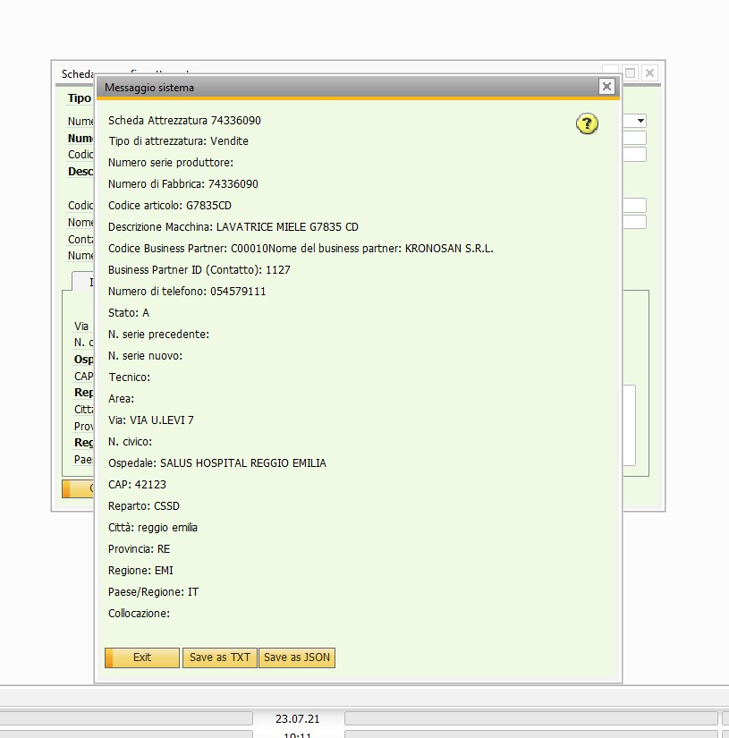
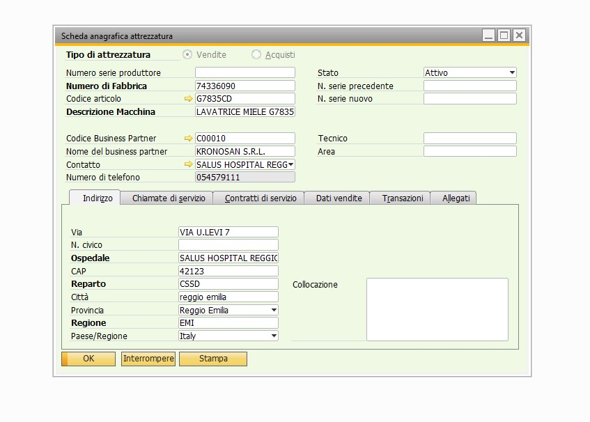

# Bachelor Thesis in Computer Science 
In this thesis I wrote about my stage in Var One Nord Est s.r.l. (ex Sinapsi Informatica).
## Company's infrastructure
In this stage I studied the company's existing infrastructure :
- **SAP B1**: studied the main modules of the ERP SAP B1
- **RESTful APIs**: understood and practiced with the APIs of SAP B1, using Postman
- **SOAP webservices**: understood and modified the company SOAP webservices in PHP, to link their mobile app with SAP B1 and the underlying SQL database 
- **Microsoft SQL server**: used this application to analyze the underlying database of the company "below" the SAP B1, where SAP actually stores data
## C# add-ons
In the last part of the stage I started to create something of mine, some kind of software. 
**Add-ons** are scripts in .NET, VB.NET or C#, to customize the SAP B1 software to the client needs. 
I did a few add-ons in C#, using the SAP B1 SDK. 
### Add-on example : Export of an equipment data instance in JSON or TXT
An example of an add-on I made during the stage is this:

Which is to save the equipment sheet's data in either a .txt file or a .json.

Here we can see that we have this 'Stampa' button, that starts this export procedure.

Here we can see the difference, without the add-on: we don't have the 'Stampa' button at all.

# Watch a preview of my thesis
To watch a preview of my thesis embedded in the browser, click this [link](Tesi_Triennale.pdf). 

If you are interested on the full version, it's possible to download the pdf file.
