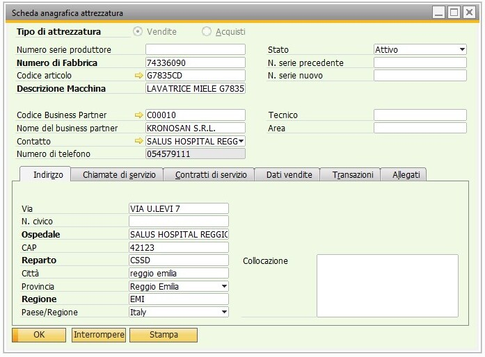
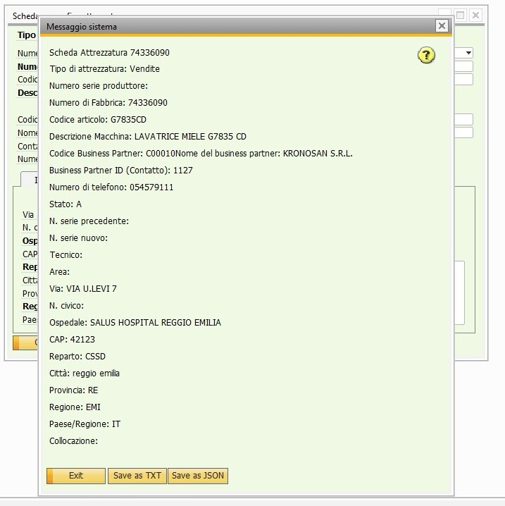
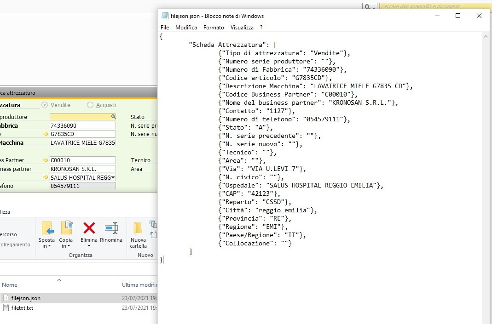
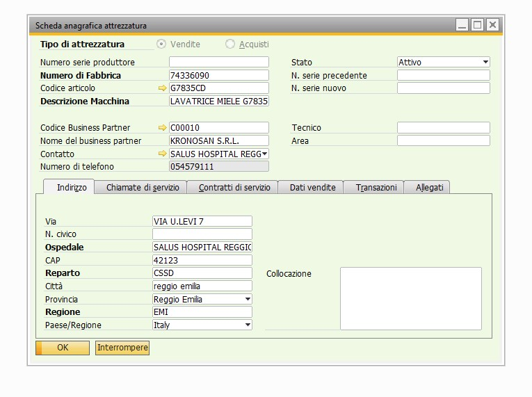

# Bachelor Thesis in Computer Science 
In this thesis I wrote about my stage in Var One Nord Est s.r.l. (ex Sinapsi Informatica).
# Watch a preview of my thesis
To watch a preview of my thesis embedded in the browser, click this [link](Bachelor_Thesis.pdf). 

If you are interested on the full version, it's possible to download the pdf file.
## Company's infrastructure
In this stage I studied the company's existing infrastructure :
- **SAP B1**: studied the main modules of the ERP SAP B1
- **RESTful APIs**: understood and practiced with the APIs of SAP B1, using Postman
- **SOAP webservices**: understood and modified the company SOAP webservices in PHP, to link their mobile app with SAP B1 and the underlying SQL database 
- **Microsoft SQL server**: used this application to analyze the underlying database of the company "below" the SAP B1, where SAP actually stores data
## C# add-ons
In the last part of the stage I started to create something of mine, some kind of software. 
**Add-ons** are scripts in .NET, VB.NET or C#, to customize the SAP B1 software to the client needs. 
I did a few add-ons in C#, using the SAP B1 SDK. 
### Add-on example : Export to JSON/TXT
Here I will show an add-on I made: this one creates a button that allows the user to save the current data form into a file JSON or TXT.
I am about to show a few screenshots representing the flow of this add-on:

As we can see from these figures, the add-on generates a 'Stampa' button : this button when clicked opens another window that shows the content of the data form in plain text, and then we can either click 'Save as TXT' or 'Save as JSON' to generate the respective file.

Here we can see that without the add-on, we don't have that 'Stampa' button at all:

---
**P.S.**: I'm sorry for the incoherence of first writing the button in italian (Stampa) and then in english (Save as JSON) and I cannot correct it anymore since it's propertiary software that I don't own. I guess it happened because the bachelor was in Italian and so was the thesis, while the SAP documentation was in English and I ended up doing a mix.

